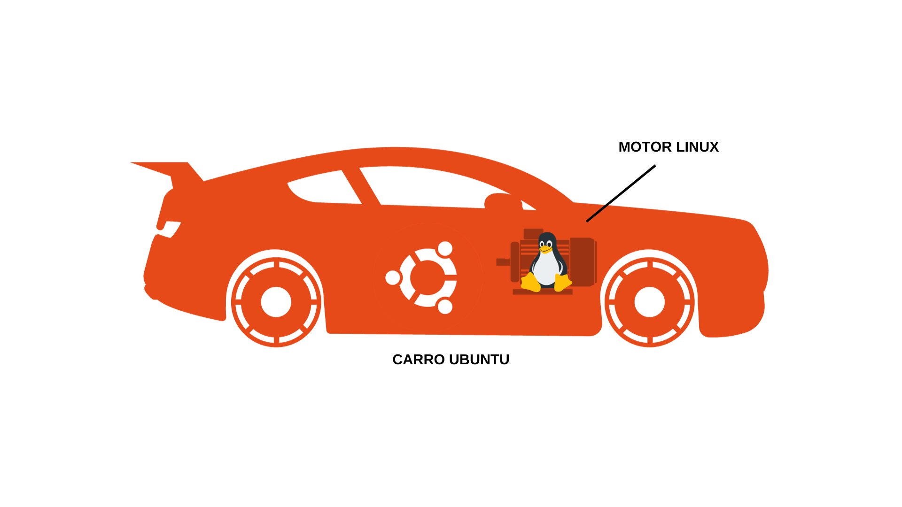

## O que é Linux? Qual seria sua resposta a essa pergunta?

Muitos acham que Linux é um sistema operacional, assim como o Windows da Microsoft ou o MacOS da Apple. Mas como vimos em sua história, o __Linux é um Kernel__.

Pense por exemplo em um carro. O carro possuí portas, vidros, bancos, faróis, pneus, rodas, freios e vários outros componentes. Mas podemos dizer que o núcleo do carro, a sua parte central seria o __motor__.

Da mesma forma __o Kernel é a parte central de um sistema operacional que conecta o software ao hardware__. Ele é responsável por gerenciar recursos como processador, memória, dispositivos de entrada e saída, além de processos de programas.

Imagine os sistemas operacionais como um carro. Temos o carro Windows, que seu motor chamamos de NT, também existe o carro MacOS que seu motor chamamos de XNU e o outro carro Ubuntu tem o __motor chamado Linux__.

> Em termos técnicos, o Linux não é um sistema operacional completo, mas sim o seu núcleo. Essa característica permite que o Linux seja adaptado para outras áreas além dos sistemas operacionais convencionais. Então, podemos pegar o Kernel Linux e criarmos um sistema operacional de computador, podemos pegar o Kernel Linux,  modificá-lo e colocarmos em um smartphone e assim por diante.